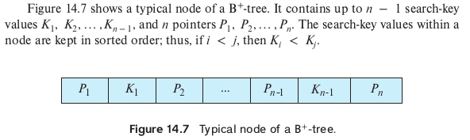
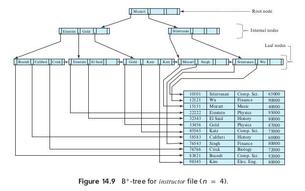
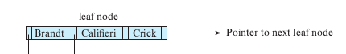
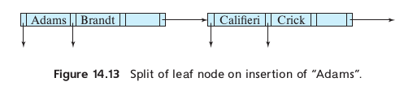
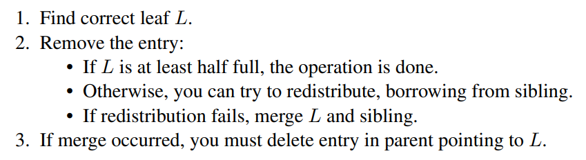

# Introduction 
In this lecture, I read the book from Ch14.1-Ch14.4, which mainly talks about indexing in database. Different index methods use different data structures.
# Odered Index 
To gain fast speed to access records in a file randomly, we can use an index structure. An **odered index** stores the value of the search key in sorted order. A **clustering index** is an index whose search key also define the sequential order of the file, in other words, records are sorted based on this index.
## Dense and Sparse index 
An index entry consist of a key-value pair, i.e.(key, pointer-to-record, or an offset within the disk block). There are two different types of indices we can use:
- Dense index 
  An index appears for every search-key value in the file. If multiple records have the same search key, then the rest of the records will be stored sequentially after the first record.
  
- Sparse index 
    In a sparse index, an index entry will only occur for several of the search-key values. Things will be slighted differently if we want to find a specfic record compared with using dense index. We need find the largest search-key value that is less or equal than the key we want to locate, and then we scan the file to find the record we want.
    
So how to choose between these two?
Basically we have to make choice between space overhead and search time, it's a trade-off. Generally, a good compromise will be to have a sparse index with one index entry per block. The reason why we did that is it takes much longer time to bring a block from disk to main memory, while scanning the block to retrieve the record we want to find is much faster.
## Multilevel index

Just like multilevel virtual address table dealing with translation from virtual address to  physcial address, we can use multilevel index to seek records quickly, which is closely related to tree structures.
## Index Update
Every update can be divided into two sub processes: fist delette then insert.
### Insertion
- Dense index
  - If the index doesn't exsisted in the index, the system will insert an index entry and a search-key value in appropriate position.
  - if the index entry stores pointers to all the same search-key value, the system will add a new pointer in the index entry. Otherwise, the index entry stores only one pointer to the first record with the search-key value, the system will place the record after the other records with the same search-key value.
- Sparse index
  We assume that each index stores one entry for each block, thus if the system creates a new block, it will insert a new search index entry too. On the other hand, if the new record has the least search-key value, the system will update the index entry pointing to the block.

### Deletion
The opposite process of insert process.
# B+-Tree Index File
- leaf node

The leaf node can atmost hold up $n-1$ values and at least contain $\left \lceil{\frac{n-1}{2}}\right \rceil$nodes. If $L_i$ and $L_j$ are both leaf node and $i < j$, then every search-key value in $L_i$ is less than $L_j$.
So the pointer $P_n$ points to the next leaf node.

- non-leaf node
In a non-leaf node, if a node contains m pointers(m <= n), pointer P_i points to the subtree that contains search-key values less than K_i, and greater than or equal to k_{i-1}. So the P_m, the final pointer of a non-leaf node, points to a subtree that contains search-key value greater than or equal to K_{m-1}.

In short, B+-tree constucts the multilevel index in a n-node tree form to make search more efficiently.
B+-tree has to be a balanced tree, i.e. the length of all the leaf node to the root node is the same. In fact, it's also the reason where B comes from.

## Udpate on B+-Tree
### Insertion
Suppose the maximum capacity of a node is 3, so the following node is full.

Now that we need to insert a new record, we need to split the leaf node.

Note that we split the leaf node, so the parent node has to have space to store the new created leaf node. If there were no room, the parent has to split too. In the worst case, we have to split non-leaf node way up to the root, if root also needs to be splited, the height of B+-Tree will increase.
### Deletion

