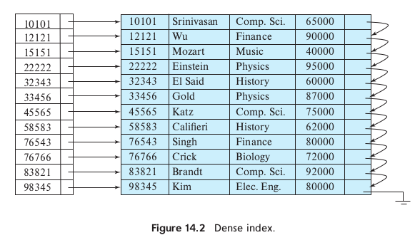
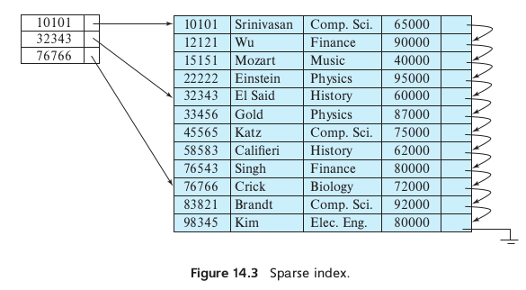
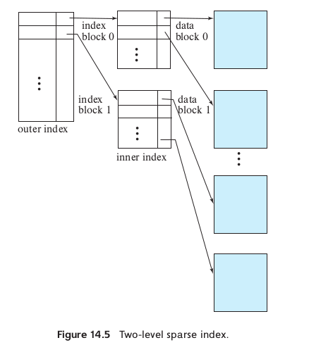

# Introduction 
In this lecture, I read the book from Ch14.1-Ch14.4, which mainly talks about indexing in database. Different index methods use different data structures.
# Odered Index 
To gain fast speed to access records in a file randomly, we can use an index structure. An **odered index** stores the value of the search key in sorted order. A **clustering index** is an index whose search key also define the sequential order of the file, in other words, records are sorted based on this index.
## Dense and Sparse index 
An index entry consist of a key-value pair, i.e.(key, pointer-to-record, or an offset within the disk block). There are two different types of indices we can use:
- Dense index 
  An index appears for every search-key value in the file. If multiple records have the same search key, then the rest of the records will be stored sequentially after the first record.
  
- Sparse index 
    In a sparse index, an index entry will only occur for several of the search-key values. Things will be slighted differently if we want to find a specfic record compared with using dense index. We need find the largest search-key value that is less or equal than the key we want to locate, and then we scan the file to find the record we want.
    
So how to choose between these two?
Basically we have to make choice between space overhead and search time, it's a trade-off. Generally, a good compromise will be to have a sparse index with one index entry per block. The reason why we did that is it takes much longer time to bring a block from disk to main memory, while scanning the block to retrieve the record we want to find is much faster.
## Multilevel index

Just like multilevel virtual address table dealing with translation from virtual address to  physcial address, we can use multilevel index to seek records quickly, which is closely related to tree structures.
## Index Update
Every update can be divided into two sub process: fist delette then insert.
### Insertion
- Dense index
  - If the index doesn't exsisted in the index, the system will insert an index entry and a search-key value in appropriate position.
  - if the index entry stores pointers to all the same search-key value, the system will add a new pointer in the index entry. Otherwise, the index entry stores only one pointer to the first record with the search-key value, the system will place the record after the other records with the same search-key value.
- Sparse index
